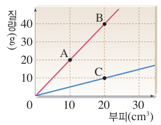

## 물질의 특성(1)
::: {style="font-size: 0.7em;"}

물질의 특성 : 특정한 조건에서 항상 일정한 값을 가지고, 물질의 양에 따라 달라지지 않는 고유한 성질

- 겉보기 특성(색깔, 냄새, 맛), 밀도, 용해도, 끓는점(녹는점) 등  
- 물질의 종류에 따라 다르다 -> 물질을 구분할 수 있다  
- 같은 물질의 경우 물질의 양에 관계없이 일정  

밀도 : !!단위 부피당 질량!!

- 밀도 = !!질량/부피!!
- 단위 : g/cm3, g/ml 등
 

:::: {.columns}

::: {.column width="45%"}
{width=100%}
:::

::: {.column width="55%"}

기울기 = 질량 / 부피 = 밀도 이므로 기울기가 클수록 밀도도 크다  
기울기 : C < A = B 이므로, 밀도 :  C < A = B  
A와 B는 기울기가 같으므로 밀도가 같고 같은 물질이다.  

:::

::::

- 밀도가 작은 물질은 밀도가 큰 물질 위에 뜬다

:::

